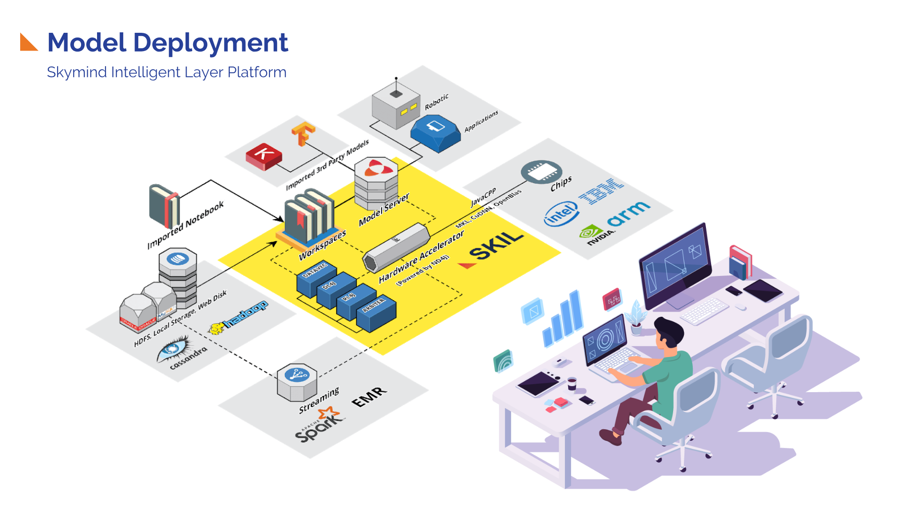
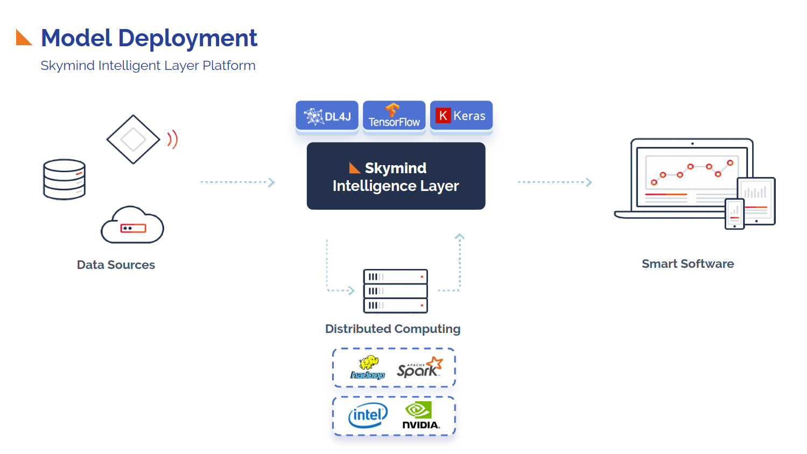

# SKIL: Skymind Intelligence Layer

This project is introduced in an attempt to demonstrate the use of original repo here: https://github.com/SkymindIO/skil-python

## MLOps - Deep Learning in Production





## Installation


### 1. SKIL's docker image
To install SKIL itself, head over to [skymind.ai](https://docs.skymind.ai/docs/docker-image). 

#### Skymindops/skil-ce
[https://hub.docker.com/r/skymindops/skil-ce](https://hub.docker.com/r/skymindops/skil-ce)


```bash
# pull the SKIL image
docker pull skymindops/skil-ce

# run the SKIL server
docker run --rm -it -p 9008:9008 skymindops/skil-ce bash /start-skil.sh

# Persisting data with Zookeeper
docker volume create --name zk-data
docker volume create --name zk-datalog
docker volume create --name skil-data
docker pull zookeeper
docker run --name zookeeper -v zk-data:/data -v zk-datalog:/datalog -d zookeeper
docker run --rm -it --name skil -v skil-data:/var/skil \
--env SKIL_EMBEDDED_DB_PATH=/var/skil/skildb \
--env ZOOKEEPER_EMBEDDED=false \
--env ZOOKEEPER_HOST=zookeeper \
--env ZOOKEEPER_PORT=2181 \
--link zookeeper:zookeeper \
-p 9008:9008 -p 8080:8080 skymindops/skil-ce bash /start-skil.sh

# stop SKIL and Zookeeper with:
docker stop skil
docker stop zookeeper

# start it back again with:
docker start zookeeper
docker run --rm -it --name skil -v skil-data:/var/skil --env SKIL_EMBEDDED_DB_PATH=/var/skil/skildb --env ZOOKEEPER_EMBEDDED=false --env ZOOKEEPER_HOST=zookeeper --env ZOOKEEPER_PORT=2181 --link zookeeper:zookeeper -p 9008:9008 -p 8080:8080 skymindops/skil-ce bash /start-skil.sh
```

#### Skymind/skil

[https://hub.docker.com/r/skymind/skil/](https://hub.docker.com/r/skymind/skil/)
```bash
# pull the SKIL image
docker pull skymind/skil
# or with gpu
docker pull skymind/skil:1.2.0-cuda10.0-spark1.6-python2-centos7


# run the SKIL server
docker run --rm -it -p 9008:9008 -p 8080:8080 skymind/skil

# persistent Data
docker volume create --name skil-data
docker volume create --name skil-conf
docker volume create --name skil-root
docker run -it --rm -v skil-root:/opt/skil -v skil-data:/var/skil -v skil-conf:/etc/skil -p 9008:9008 -p 8080:8080 -d skymind/skil

# If you already have a license file, you can link it with docker in the following way:
docker volume create --name skil-data
docker volume create --name skil-root
docker run -it --rm -v skil-root:/opt/skil -v skil-data:/var/skil -v /path/to/license:/etc/skil/license.txt -p 9008:9008 -p 8080:8080 -d skymind/skil

# stop SKIL with:
docker stop <container_name>

# start it back again with (depending on your configuration):
docker run -it --rm -v skil-root:/opt/skil -v skil-data:/var/skil -v skil-conf:/etc/skil -p 9008:9008 -p 8080:8080 -d skymind/skil
# OR
docker run -it --rm -v skil-root:/opt/skil -v skil-data:/var/skil -v /path/to/license:/etc/skil/license.txt -p 9008:9008 -p 8080:8080 -d skymind/skil
```


Now, you can access the SKIL UI by opening a browser window to [http://localhost:9008](http://localhost:9008) 


### 2. SKIL client

**python client**
SKIL's Python client can be SKIL's Docker Imagenstalled from PyPI:

```bash
pip install skil --user
```

**java client**
## Getting started

## Features

### 1. Textual Information
* NLP
* Text Classification
* Word2Vec

### 2. Image & Video
* YOLO2
* Inception
* VGG

### 3. Numerical and/or Categorical

### 4. Time series


## References:

* []()


