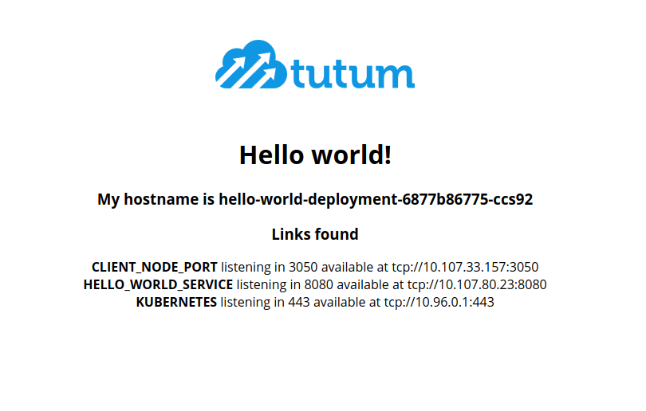
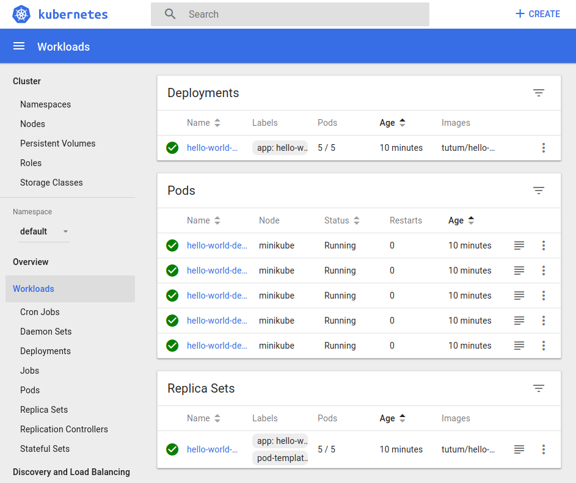

# Simple Kubernetes Deployment

## Getting started


### 1. Single docker container

```bash
docker run --rm -it -p 3000:80 tutum/hello-world
```

### 2. Kubernetes deployment

```yaml
---
kind: Service
apiVersion: v1
metadata:
  name: hello-world-service
spec:
  selector:
    app: hello-world
  ports:
    - protocol: "TCP"
      # Port accessible inside cluster
      port: 8080
      # Port to forward to inside the pod
      targetPort: 80
      # Port accessible outside cluster
      nodePort: 30001
  type: LoadBalancer
 
---
apiVersion: extensions/v1beta1
kind: Deployment
metadata:
  name: hello-world-deployment
spec:
  replicas: 5
  template:
    metadata:
      labels:
        app: hello-world
    spec:
      containers:
        - name: hello-world
          image: tutum/hello-world
          ports:
            - containerPort: 80
```

### 3. Commands
```bash
minikube start
minikube dashboard

kubectl get nodes
kubectl get pods
kubectl get services
kubectl cluster-info

kubectl apply -f deployment.yaml
```

**hello-world-client**:
[http://192.168.99.100:30001](http://192.168.99.100:30001)
 
**Minikube Deshboard: **
[http://127.0.0.1:42621/api/v1/namespaces/kube-system/services/http:kubernetes-dashboard:/proxy/#!/workload?namespace=default
](http://127.0.0.1:42621/api/v1/namespaces/kube-system/services/http:kubernetes-dashboard:/proxy/#!/workload?namespace=default)

 

## Reference

* [https://github.com/StephenGrider/DockerCasts](https://github.com/StephenGrider/DockerCasts) 
* [https://www.youtube.com/watch?v=1xo-0gCVhTU](https://www.youtube.com/watch?v=1xo-0gCVhTU)